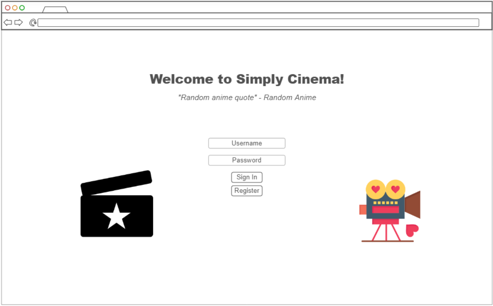
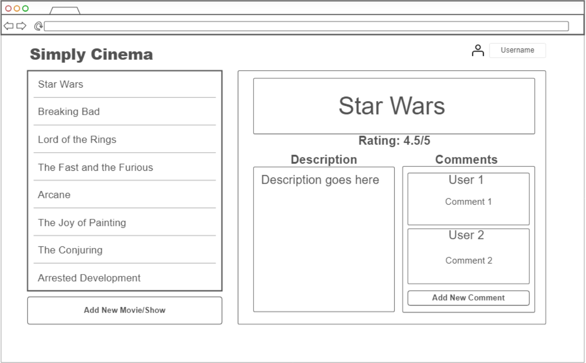

# Startup
Startup project for BYU CS 260

## Startup Specification ##

### Elevator Pitch ###
In today's world, there is so much media being produced that it can be hard to keep up! Big corporations are pumping out TV shows and movies 
at an astonishing rate, with most of them being cheap cash grabs or bloated spin-offs. Who has the time to sort through everything ever made 
to try and find something new to watch? My startup, Simply Cinema, aims to help you sort through the sea of mediocrity with the help of your 
friends. Whenever you or your friend watches something new you can add its data to the database, which is then instantly shared with everyone. 
You can give the show or movie a description, rating, and leave comments. You can find new recommended shows to watch, or warn your friends 
about a movie that's not worth their time. The power is in your hands with Simply Cinema!

### Proof-of-Concept Design ###

### Key Features ###
- Secure login over HTTPS
- Display of all movies/shows that have been added to the database
- Ability to select a movie/show and see the description, rating, and comments
- Ability to add a new movie/show and description to the list
- Ability to add a new comment and rating to a movie/show
- New movies/shows are added to other user's devices in real time
- All movies/shows added to the list are saved to the database

### Technologies ###
I am going to use the required technologies in the following ways:

- **HTML:** Uses correct HTML structure with three HTML pages. One for logging in/registering, one for creating movie/show descriptions, and one for creating comments and ratings.
- **CSS:** Adaptable to different screen sizes with a simple, minimal design. Good use of color, contrast, and whitespace.
- **JavaScript:** Provides login/registration, movie/show selection, creating movie/show descriptions, creating movie/show comments and 
ratings, backend endpoint calls.
- **React:** Single page application, with views componentized and dynamic updates in response to user actions.
- **Web Service:** Backend service with endpoints for:
  - Login
  - Retrieving movie/show list
  - Retrieving individual movie/show
  - Retrieving comment and rating list for movie/show
  - Retrieve a random anime quote from https://github.com/Animechan-API/animechan
  - Creating new movie/show
  - Creating new comment and rating
- **DB/Login:** Store users, movie/show descriptions, and movie/show comments/ratings in database. Register and login users. Credentials securely stored in database. Cannot access the media/comments page unless logged in.
- **WebSocket:** Whenever a new movie/show or comment and rating is added, all other users are updated with that information.

## HTML Deliverable ##
For this deliverable I built out the structure of my application using HTML.

- **HTML Pages:** Three HTML pages that represent the ability to login, read and create shows, and read and create descriptions/comments
- **Links:** The login, create, and comment pages all link to each other through the header. Also added link to the startup GitHub page on the footer.
- **Text:** Text is used in the place of many services that will be added in later. Examples include the quote on the login page that will be replaced with a call to an outside API (3rd party service call), as well as all the comment, description, and movie data that comes from the database.
- **Images:** Two images were added to the login page.
- **DB/Login:** Input box and submit button for login. The username is displayed once the user is signed in, represented by the user name in the create page. Input box and submission buttons also for creating a new show/movie, a new description, a new comment, and a new rating, all of which will be put in the database. The list of movies and comments represent data pulled from the database.
- **WebSocket:** The fully populated lists of both comments and movies/shows represents the data that will be updated in real time whenever a new one is created.

## CSS Deliverable ##
For this deliverable I properly styled the application into its final appearance.

- **Header, footer, and main content body:** All have been styled and formatted.
- **Navigation elements:** Underlines have been removed, and the process has been streamlined. There is no longer a link to the description/comments page from the top navigation bar. This allows the formatting of the top bar to flex better, as well as reduce confusion for the user when the app is fully complete. To get to the description/comments page, click on any of the movie/tv show titles on the "Movies/TV Shows" page.
- **Responsive to window resizing:** I've checked my app on all the different screens I could, and it looks good on all of them! To make the login screen formatting work, I had to make the pictures disappear after it gets to a certain width. Additionally, the orientation of the description and comments goes from horizontal to vertical as the screen gets narrower.
- **Application elements:** All the parts of my application are there, and I tried my best to make good use of spacing so as to not make it feel too cluttered.
- **Application text content:** Consistent fonts and formatting throughout the whole application.
- **Application images:** The 2 images on the login page have been formated and spaced accordingly. When the window gets too narrow and the pictures start to cause formatting issues, they disappear so as to not hinder the user experience. 

## React Deliverable
For this deliverable I used JavaScript and React so that the application completely works for a single user. I also added placeholders for future technology.

- **Bundled and transpiled** - done!
- **Components** - Login, creating new media, and descriptions, comments, and rating are all components with mocks for each, including the WebSocket functionality that will later be applied to the comments section.
  - **login** - When you press enter or the login button it "signs you in" and allows you to access the list of media and interact with it.
  - **database** - Added fuctionality to display the list of media as well as the description, comments, and ratings. Currently this is stored and retrieved from local storage, but it will be replaced with the database data later.
  - **WebSocket** - I used the setInterval function to periodically add a comment to the commments tab. This will be replaced with WebSocket messages later.
- **Router** - Routing between login, create, and comment components.
- **Hooks** - Added many hooks throughout the program, with multiple being used in app.jsx, login.jsx, create.jsx, and comment.jsx.

## Service Deliverable
For this deliverable I added backend endpoints that receives votes and returns the voting totals.

- **Node.js/Express HTTP service** - done!
- **Static middleware for frontend** - done!
- **Calls to third party endpoints** - done! I wasn't able to get the exact third-party public endpoint to work the way I wanted, so I settled for a Kanye West quote endpoint and it does the trick!
- **Backend service endpoints** - Placeholders for login that stores the current user on the server. Endpoints for getting and saving media items, as well as descriptions, comments, and ratings.
- **Frontend calls service endpoints** - I did this using the fetch function.