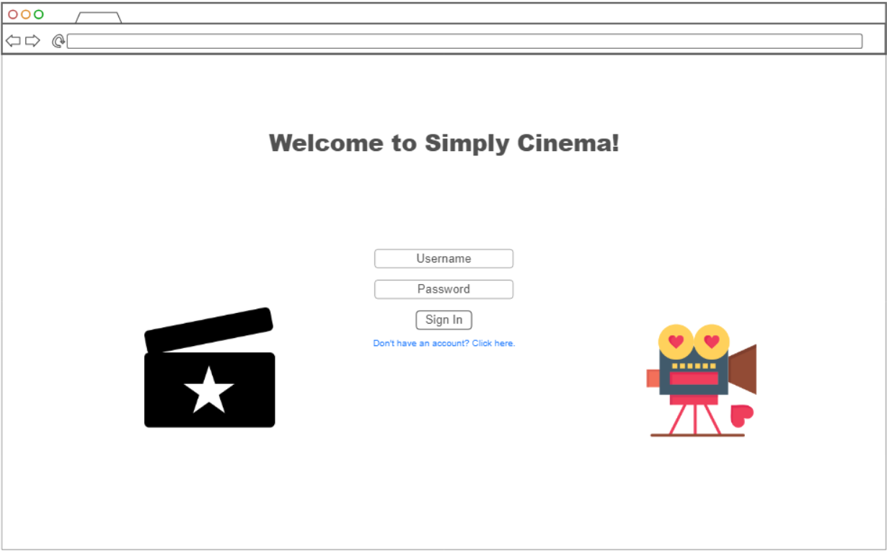
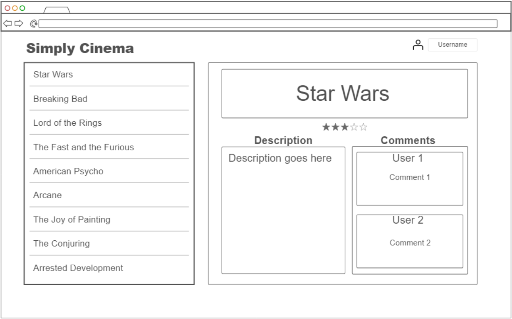

# Startup
Startup project for BYU CS 260

## Startup Specification ##

### Elevator Pitch ###
In today's world, there is so much media being produced that it can be hard to keep up! Big corporations are pumping out TV shows and movies 
at an astonishing rate, with most of them being cheap cash grabs or bloated spin-offs. However, in today's world time is valuable. Who has the 
time to sort through everything ever made to try and find something new to watch? My startup, Simply Cinema, aims to help you sort 
through the sea of mediocrity with the help of your friends. Whenever you or your friend watches something new you can add its data to the 
database, which is then instantly shared with everyone. You can give the show or movie a description, rating, and leave comments. You can find 
new recommended shows to watch, or warn your friends about a movie that's not worth their time. The power is in your hands with Simply Cinema!

### Proof-of-Concept Design ###

### Key Features ###
- Secure login over HTTPS
- Display of all movies/shows that have been added to the database
- Ability to select a movie/show and see the description, rating, and comments
- Ability to add a new movie/show and description to the list
- Ability to add a new comment and rating to a movie/show
- New movies/shows are added to other user's devices in real time
- All movies/shows added to the list are saved to the database

### Technologies ###
I am going to use the required technologies in the following ways:

- **HTML:** Uses correct HTML structure with two HTML pages. One is used for loging in/registering, while the other is used for creating movie/
show descriptions and rating/commenting on them.
- **CSS:** Adaptable to different screen sizes with a simple, minimal design. Good use of color, contrast, and whitespace.
- **JavaScript:** Provides login/registration, movie/show selection, creating movie/show descriptions, creating movie/show comments and 
ratings, backend endpoint calls.
- **React:** Single page application, with views componentized and dynamic updates in response to user actions.
- **Web Service:** Backend service with endpoints for:
  - Retrieving movie/show list
  - Retrieving individual movie/show
  - Retrieving comment and rating list for movie/show
  - Retrieve a random anime quote from https://github.com/Animechan-API/animechan
  - Creating new movie/show
  - Creating new comment and rating
- **DB/Login:** Store users, movie/show descriptions, and movie/show comments/ratings in database. Register and login users. Credentials securely stored in database. Cannot access the media/comments page unless logged in.
- **WebSocket:** Whenever a new movie/show or comment and rating is added, all other users are updated with that information.